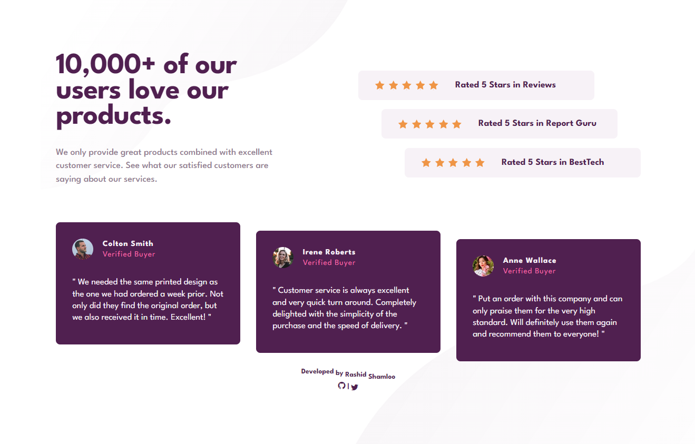
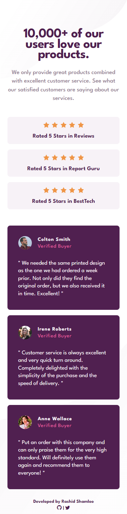

# Front End Mentor - Project 008 - Social Proof Section

This is a solution to the [Social Proof Section challenge on Frontend Mentor](https://www.frontendmentor.io/challenges/social-proof-section-6e0qTv_bA).

## Table of contents

- [Overview](#overview)
  - [Screenshot](#screenshot)
  - [Links](#links)
- [My process](#my-process)
  - [Built with](#built-with)
  - [What I learned](#what-i-learned)
- [Author](#author)

## Overview

### Screenshot

- Desktop

- Mobile

### Links

- Solution URL: https://github.com/rashidshamloo/fem_008_social-proof-section/
- Live Site URL: https://rashidshamloo.github.io/fem_008_social-proof-section/

## My process

### Built with

- Semantic HTML5 markup
- Sass
- Flexbox

### What I learned

- Flexbox, Lots of Flexbox!
- Positioning elements in CSS using "margin" and "position:relative"
- Multiple media queries for different screen widths

## Author

- Frontend Mentor - [@rashidshamloo](https://www.frontendmentor.io/profile/rashidshamloo)
- Twitter - [@rashidshamloo](https://www.twitter.com/rashidshamloo)
